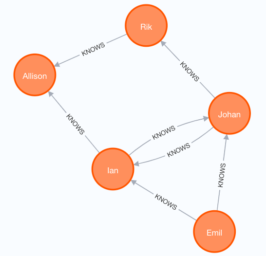
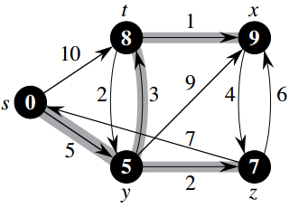

# Neo4j Phase 3

Here are two python applications of Neo4j:
1. The first illustrates CRUD operations of graph as in Phase 2.
2. The second solves a shortest path based on Dijkstra's algorithm.

## Install Driver
`pip3 install neo4j-driver`

## App1 - Graph CRUD
Model Data:  

Run:  
`python3 Proj2_Phase3_App1_Neo4j.py`

Output:  
`Emil info:`  
`{'name': 'Emil', 'from': 'Sweden', 'kloutScore': 100}`  
`Emil friends:`  
`{'name': 'Ian', 'from': 'England', 'title': 'author'}`  
`{'learn': 'surfing', 'name': 'Johan', 'from': 'Sweden'}`

## App2 - Shortest Path
Model Data:  

Note:  
Connect a Neo4j database that supports Graph Data Science library.  
https://neo4j.com/product/graph-data-science/

Run:  
`python3 Proj2_Phase3_App2_Neo4j.py`

Output:  
`Shortest path from s to x:`  
`{'totalCost': 9.0, 'nodeNames': ['s', 'y', 't', 'x']}`
